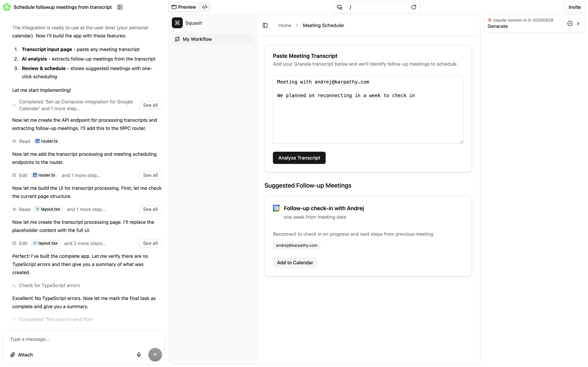

# Squash

An AI-powered coding agent platform that enables you to build powerful internal tools through natural language conversations.

**Try it now at [squash.build](https://squash.build)**



## What is Squash?

Squash helps you build internal tools by chatting with AI. Describe what you want to build in plain English, and Squash will write the code, set up the project structure, and provide live previews — all in real-time.

## Features

- **Conversational Development** — Build applications by chatting with an AI agent that understands your intent and writes production-quality code
- **Live Previews** — See your changes instantly with real-time preview updates as the agent modifies your code
- **Isolated Sandboxes** — Each project runs in its own secure, isolated environment powered by Daytona
- **Pre-built Templates** — Start from curated templates including Vite + TypeScript and full-stack setups with tRPC and Cloudflare Workers
- **Multi-Provider AI Gateway** — Unified interface for OpenAI, Anthropic, and Google models within your generated applications
- **MCP Integrations** — Connect to external services via Composio for enhanced capabilities

## Architecture

Squash is a monorepo built with pnpm workspaces and Turborepo:

```
squash/
├── packages/
│   ├── app/              # React frontend (Vite, Tailwind, Clerk)
│   ├── api/              # Cloudflare Worker backend (Hono, Drizzle)
│   ├── cli/              # CLI wrapper for Claude Code agent
│   ├── ai-sdk-claude-code/  # Vercel AI SDK adapter
│   ├── iframe-bridge/    # Preview iframe communication
│   ├── mcp-composio/     # MCP server for Composio integrations
│   ├── preview-proxy/    # Preview URL proxy service
│   └── screenshot-api/   # Screenshot generation service
├── templates/            # Starter project templates
└── patches/              # Dependency patches
```

## Getting Started

### Prerequisites

- Node.js 18+
- pnpm 10+
- Docker (for local database)

### Installation

```bash
# Clone the repository
git clone https://github.com/squashai/squash.git
cd squash

# Install dependencies
pnpm install
```

### Environment Setup

Create a `.env` file in the root directory with the required environment variables (see each package's documentation for specific requirements).

### Running Locally

```bash
# Start all services in development mode
pnpm dev
```

This will start:

- The frontend app on `http://localhost:5173`
- The API server via Wrangler
- Local PostgreSQL database via Docker

## Tech Stack

- **Frontend**: React 19, Vite, Tailwind CSS, Radix UI
- **Backend**: Hono, Cloudflare Workers, Drizzle ORM
- **Database**: PostgreSQL (Neon serverless)
- **Auth**: Clerk
- **AI**: Anthropic Claude Code, Vercel AI SDK
- **Sandboxes**: Daytona
- **Build**: Turborepo, pnpm workspaces

## Packages

| Package                        | Description                                 |
| ------------------------------ | ------------------------------------------- |
| `@squashai/app`                | Web application frontend                    |
| `@squashai/api`                | Backend API and agent orchestration         |
| `@squashai/cli`                | Command-line interface for the coding agent |
| `@squashai/ai-sdk-claude-code` | Vercel AI SDK provider for Claude Code      |
| `@squashai/iframe-bridge`      | Communication layer for preview iframes     |

## License

Private
